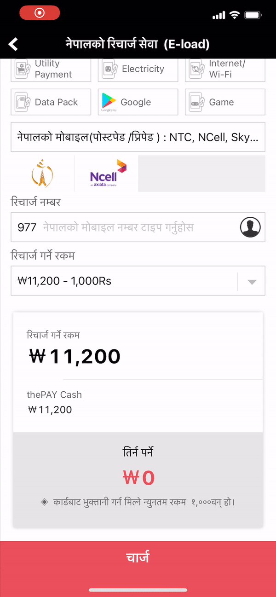

# SpringText

[]()
[](https://travis-ci.org/comcxx11/SpringText)
[](https://cocoapods.org/pods/SpringText)
[](https://cocoapods.org/pods/SpringText)
[](https://cocoapods.org/pods/SpringText)

## Example

To run the example project, clone the repo, and run `pod install` from the Example directory first.



## Requirements
- iOS 9.3

## Usage

The usage is very similar to `UITextField` text properties.
`SPLabel` has two options: Normal, Currency
```swift
lblAmount.text(num:192398)
```

Default currency symbol is `dollor` sign `$`
```swift
lblAmount.setCurrency(symbol: "￦")
lblAmount.text(num:192398, showCurrency:true)
```

## Installation

SpringText is available through [CocoaPods](https://cocoapods.org). To install
it, simply add the following line to your Podfile:

```ruby
pod 'SpringText'
```

## Author

comcxx11, comcxx11@gmail.com

## License

SpringText is available under the MIT license. See the LICENSE file for more info.
